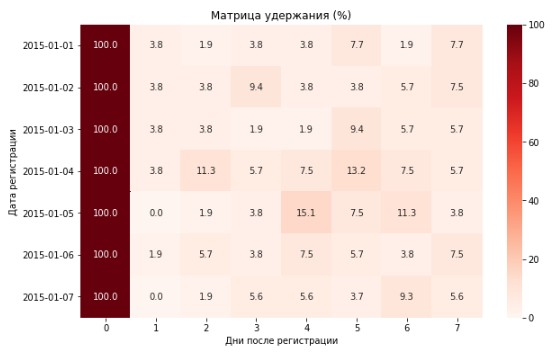
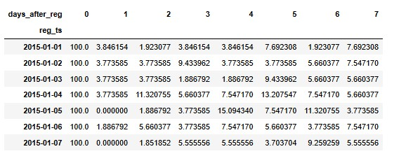
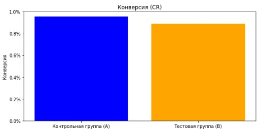
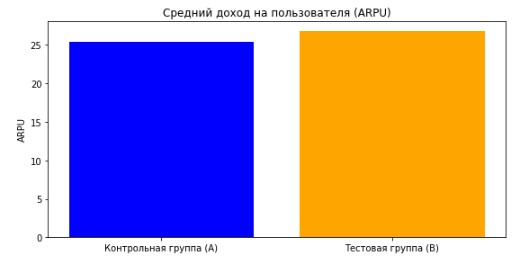
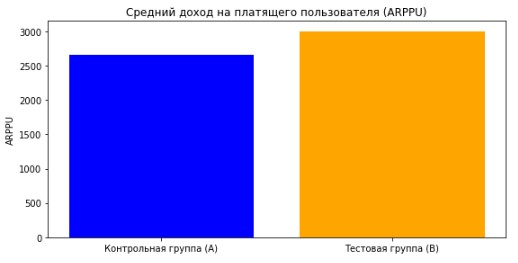

# Mobile Game Data Analysis
## Retention, A/B Testing and Event Metrics

В проекте проведён анализ данных мобильной игры.  
Изучены ключевые показатели удержания пользователей, проведено A/B-тестирование акционных предложений, а также предложены метрики для оценки успешности тематических игровых событий.

[📘 **Открыть ноутбук на GitHub**](https://github.com/melnikovand92/Mobile-Game-Data-Analysis/blob/main/Mobile-Game-Data-Analysis.ipynb)

---

## 📊 Используемые инструменты
- Python: `pandas`, `numpy`, `scipy`, `matplotlib`, `seaborn`
- Jupyter Notebook

---

## 🎯 Цели исследования
1. Разработка функции для расчёта **retention** (удержание пользователей по дням).  
2. Анализ результатов **A/B-теста** двух наборов акций (по метрикам ARPU и конверсии в покупку).  
3. Предложение метрик для оценки результатов тематического события **Plants & Gardens** и анализ сценария усложнённой механики.

---

## 🚀 План исследования
### Задание 1. Retention
- Загрузка данных  
- Предварительный анализ  
- Преобразование формата даты  
- Функция для подсчёта retention  

### Задание 2. A/B-тест
- Загрузка и анализ данных  
- Расчёт ARPU и доли платящих игроков  
- Проверка статистической значимости  
- Выводы  

### Задание 3. Метрики игрового события
- Определение ключевых метрик  
- Анализ сценария с усложнением механики  
- Выводы  

---

## 🖼️ Визуализации

### Retention
|  |  |
|:--:|:--:|
| *Динамика удержания игроков по дням* | *Сравнение retention групп* |

---

### A/B-тест
|  |  |
|:--:|:--:|
| *Распределение ARPU по группам* | *Сравнение платящих игроков* |

  
*Результаты статистической проверки различий между группами*

---

## ✅ Результаты
- **Retention:** рассчитан и визуализирован показатель удержания.  
- **A/B-тест:** хотя ARPU вырос на **5%**, тестовая группа показала **снижение конверсии**, что оказалось статистически значимым.  
  ➡️ **Вывод:** эксперимент неудачный, рекомендуется оставить вариант **A**.  
- **Игровое событие:** предложен набор метрик (участие, активность, вовлечённость, монетизация). Рассмотрено влияние усложнённой механики на интерпретацию результатов.

---

## ⚙️ Как запустить проект
```bash
git clone https://github.com/melnikovand92/Mobile-Game-Data-Analysis.git
cd Mobile-Game-Data-Analysis
pip install -r requirements.txt
jupyter notebook
